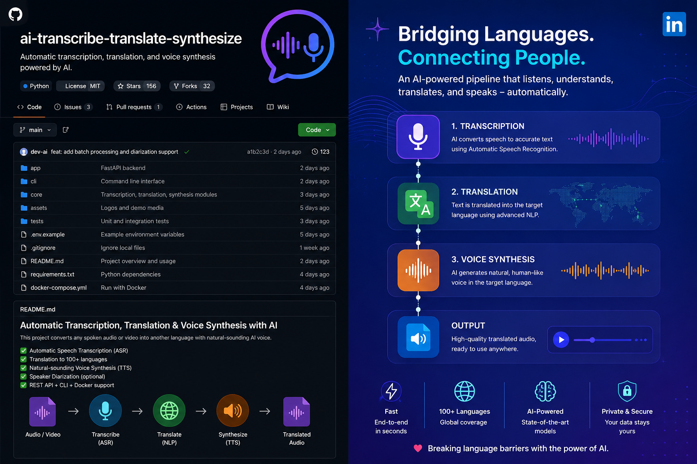

# AutoTranslation

Real-time AI subtitles for streaming and any audio playing on your Windows PC. Captures system audio, transcribes speech, translates it, and overlays subtitles in your browser.



## How it works

```
System audio (WASAPI loopback)
        ↓
   Speech-to-text (Whisper)
        ↓
   Translation engine
        ↓
   WebSocket → Chrome extension overlay
        ↓ (optional)
   Edge TTS → local output device (speakers/headphones)
```

## Requirements

- **Windows** (uses WASAPI loopback audio capture)
- **Python 3.10+**
- **Chrome** or **Edge** (Chromium)

## Quick start

### 1. Install the Python service

```powershell
cd AutoTranslation
python -m venv .venv
.\.venv\Scripts\pip install -r requirements.txt

# For local Whisper (no OpenAI key needed):
.\.venv\Scripts\pip install "faster-whisper>=1.0.0" numpy

# Create your config from the example:
copy config.json.example config.json
```

### 2. Run the service

```powershell
.\.venv\Scripts\python.exe run.py
```

You should see:

```
[WhisperLocal] model 'base' ready
[WS] listening on ws://127.0.0.1:8765
[AudioCapture] capturing from '...' at 48000Hz, 2ch
```

**Important:** Audio must play through your **default Windows output device** — the service captures loopback from that device, not the microphone.

> **Using VB-Audio Virtual Cable?** See [Audio routing with VB-Cable](#audio-routing-with-vb-audio-virtual-cable) below.

### 3. Load the browser extension

1. Open `chrome://extensions`
2. Enable **Developer mode**
3. Click **Load unpacked**
4. Select the `extension` folder in this repo
5. Open a video page, click the extension icon, and click **Apply settings**

The status dot should turn green when connected to the service.

## Configuration

Edit `config.json` (copy from `config.json.example`) or use the extension popup.

### Speech-to-text (STT)

| Engine | Description |
|--------|-------------|
| `whisper_local` | Runs locally via [faster-whisper](https://github.com/SYSTRAN/faster-whisper). Free, offline after first model download (~150 MB for `base`). |
| `whisper_api` | OpenAI Whisper API. Requires an API key. |

### Translation

| Engine | Description |
|--------|-------------|
| `mymemory` | Free, no API key. Good default. ~500 requests/day. |
| `claude` | Anthropic API. Requires API key in `config.json`. |
| `openai` | OpenAI GPT. Requires API key. |
| `ollama` | Local [Ollama](https://ollama.com/) instance. |
| `cursor` | Uses Cursor install auth (experimental). |

Set `target_language` to any language name (e.g. `Russian`, `Spanish`, `Japanese`).

### Voice synthesis (TTS)

Enable **Voice synthesis** in the popup to hear translated speech read aloud. Neural voices are auto-selected for your target language via Microsoft Edge TTS (no API key required).

**Audio routing for TTS** — if you use VB-Audio Cable, Chrome's audio output is routed through VB-Cable, which means TTS audio played inside the browser is _also_ captured by the loopback, creating an infinite echo loop:

```
TTS plays in Chrome → Chrome output → VB-Cable → loopback capture → STT → translate → TTS → ...
```

The fix: set **Play voice to** in the extension popup to your speakers or headphones. The service then plays TTS directly via Python (bypassing VB-Cable entirely), so the loopback only captures the original source audio.

## Audio routing with VB-Audio Virtual Cable

[VB-Audio Virtual Cable](https://vb-audio.com/Cable/) lets you capture audio from a specific app (e.g. Chrome) rather than all system audio.

**Setup:**
1. Install VB-Cable and reboot if prompted
2. In Chrome settings (or Windows Volume Mixer), set Chrome's output device to **CABLE Input (VB-Audio Virtual Cable)**
3. In the extension popup → **Audio routing**:
   - **Capture from** → `CABLE Output (VB-Audio Virtual Cable)` — selects the VB-Cable loopback as the capture source (requires service restart)
   - **Play voice to** → your speakers or headphones — TTS plays through Python directly, not through Chrome, avoiding echo
4. Your regular system audio (other apps) continues to play normally on your default device

> **Note:** After changing **Capture from**, restart the service (`run.py`) for it to take effect.  
> **Capture from** and **Play voice to** dropdowns are populated automatically from devices detected by the service.

## Chunk boundary handling

Audio is processed in fixed-size chunks (default 4 seconds). A naive implementation cuts audio at hard time boundaries, which means words that happen to span two chunks get split mid-syllable — Whisper then transcribes garbled partial words at the end of one chunk and the start of the next.

AutoTranslation solves this with three layers working together:

### 1. Audio overlap
The last 0.8 seconds of each chunk is prepended to the beginning of the next chunk. This "tail buffer" ensures that any word spanning the boundary always appears complete in at least one chunk's audio.

```
Chunk N:  [-------- 4.0 s --------][tail]
Chunk N+1:              [tail][-------- 4.0 s --------][tail]
                         ↑
                    boundary word is now whole
```

The tail size is configurable (`audio.overlap_seconds` in `config.json`, default `0.8`).

### 2. Context prompting
The last ~100 characters of the previous chunk's transcript are passed to Whisper as a `prompt` (Whisper API) or `initial_prompt` (local faster-whisper). This conditions the language model decoder to continue naturally from where the previous chunk ended, improving accuracy for context-dependent words and names.

### 3. Transcript deduplication
Because the overlap audio is transcribed twice (once in chunk N, once at the start of chunk N+1), the pipeline strips the repeated words before broadcasting. The deduplication uses exact word matching first, with a fuzzy `SequenceMatcher` fallback for cases where Whisper slightly rephrases the same audio on the second pass.

### Mute window protection
When TTS voice synthesis is active, incoming audio is muted for the duration of playback to prevent echo. Whenever a chunk is dropped during the mute window, the overlap tail buffer and transcript context are both cleared — ensuring that TTS audio cannot contaminate the context for the first real speech chunk that follows.

## Project structure

```
AutoTranslation/
├── run.py                 # Entry point
├── config.json.example    # Config template
├── requirements.txt
├── service/
│   ├── main.py            # Async service orchestration
│   ├── pipeline.py        # STT → translation → TTS pipeline
│   ├── audio_capture.py   # Windows WASAPI loopback
│   ├── websocket_server.py
│   └── engines/
│       ├── stt/           # Whisper API & local
│       ├── translation/   # MyMemory, Claude, OpenAI, Ollama, Cursor
│       └── tts/           # Edge TTS (local device playback)
└── extension/             # Chrome MV3 extension
    ├── manifest.json
    ├── background.js      # WebSocket client
    ├── content.js         # Subtitle overlay + browser-side TTS fallback
    └── popup.html/js      # Settings UI (incl. audio routing dropdowns)
```

## Troubleshooting

| Problem | Fix |
|---------|-----|
| Port already in use (`10048`) | Kill stale processes: `Get-Process python* \| Stop-Process -Force` |
| No subtitles | Ensure audio plays on your default output device; check green status dot in popup |
| No speech detected | Set the correct device as Windows default output; play audio through it |
| Settings not saving | Service must be running; popup shows "Not connected!" if WebSocket is down |
| Cyrillic / Unicode crash | Fixed in `run.py` via UTF-8 console reconfigure |
| TTS echo loop | Set **Play voice to** → your speakers in the popup so TTS plays via the service, not Chrome |
| Changed "Capture from" but still capturing old device | Requires service restart to take effect |
| Switched back from VB-Cable and lost system sound | Check Windows Volume Mixer — Chrome may still have VB-Cable set as its per-app output device |

## License

MIT
